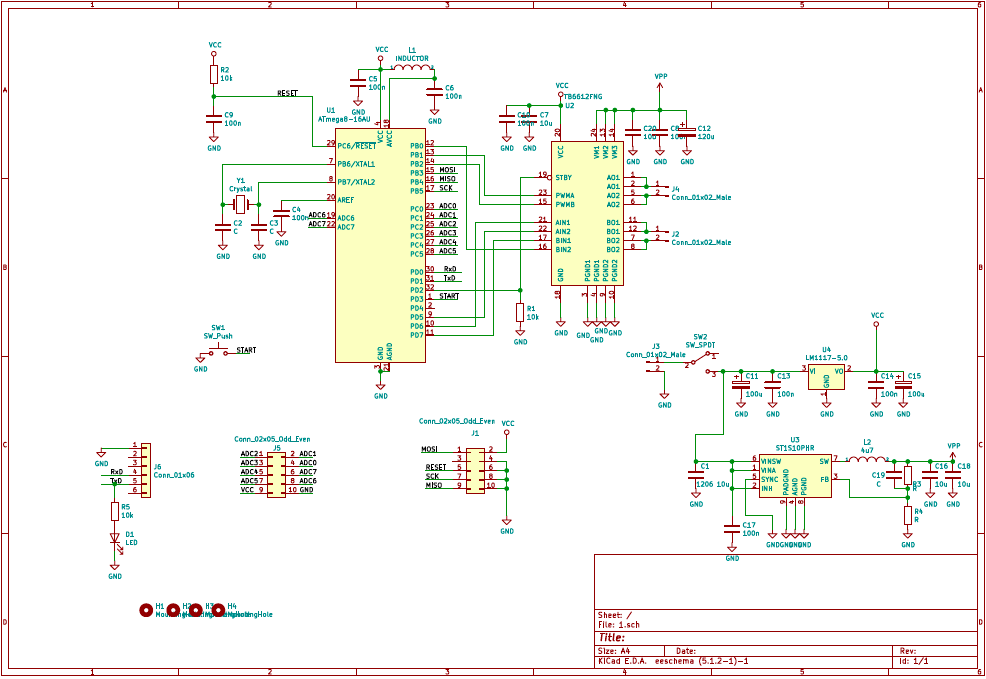

# Line Follower

Easy algorithm for a line follower robot, build for a class. 

## Building blocks

* Microprocessor: AVR atmega328p
* Two DC motors
* A few transoptors

## Scheme

## What to improve

* Make it smaller and lighter
* Make the sensors wider
* Make it faster